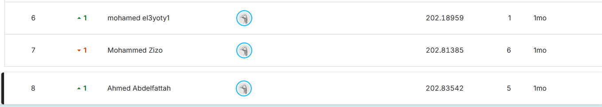

# Kaggle Tabular Regression Project

## Project Overview

This project is a **tabular regression competition** focused on predicting a continuous target variable from a set of numerical and categorical features.

The notebook follows a complete machine learning workflow:

**EDA → Categorical Encoding → Train/Validation Split → Baseline Model → Nonlinear Models → Cross-Validation → Model Comparison → Test Prediction → Kaggle Submission**

The final CatBoost submission scored **RMSE 202.83542 on the Kaggle leaderboard and ranked 8th**.

---

## Objective

The objective is to build regression models that accurately predict the `target` variable and generate predictions for the competition test set.

The primary evaluation metric used in the notebook is **Root Mean Squared Error (RMSE)**.

> Lower RMSE indicates better predictive performance.

---

## Dataset

The training dataset contains **5,757 rows and 14 columns**:

* `id` — unique identifier
* `f01`–`f12` — predictive features
* `target` — continuous regression target

Feature types in the training data:

* **9 floating-point features**
* **2 integer features**
* **3 object/categorical features including `id`**

The notebook reports **no missing values** and **no duplicate rows** in the training dataset.

### Target Distribution

|Statistic|Value|
|-|-:|
|Count|5,757|
|Mean|728.996|
|Std|637.203|
|Minimum|2|
|Median|545|
|Maximum|3,556|

---

## Exploratory Data Analysis

The notebook performs several EDA steps:

* Dataset structure and data types
* Missing-value inspection
* Duplicate-row inspection
* Statistical summary
* Numerical feature distributions using histograms
* Categorical feature distributions using count plots
* Correlation analysis using a heatmap

This provides an initial understanding of feature distributions, relationships, and data quality before modeling.

---

## Preprocessing

### Categorical Features

Two categorical features require encoding:

* `f04` → One-Hot Encoding
* `f08` → Label Encoding

The `id` column is excluded from model training because it serves as an identifier rather than a predictive feature.

After encoding, the model input contains **14 features**.

---

## Train / Validation Split

The encoded dataset is divided into:

* **80% training:** 4,605 samples
* **20% validation:** 1,152 samples

The split uses:

```python
random_state=42
```

The notebook uses the validation portion to compare model performance before generating the final competition predictions.

---

## Models

Several regression approaches were evaluated, starting with a simple linear baseline and progressing to nonlinear ensemble models.

### 1. Linear Regression

Used as the baseline model to establish a simple linear reference.

**Validation RMSE:**

`429.323`

---

### 2. Polynomial Regression

A degree-4 polynomial transformation was combined with Linear Regression to capture nonlinear relationships.

**Validation RMSE:**

`383.327`

---

### 3. Random Forest Regressor

A tree-based ensemble model capable of learning nonlinear relationships and feature interactions.

**Validation RMSE:**

`219.537`

---

### 4. XGBoost Regressor

A gradient-boosting model using sequential decision trees.

**Validation RMSE:**

`210.585`

---

### 5. CatBoost Regressor

A gradient-boosting model evaluated with the encoded feature representation.

**Validation RMSE:**

`197.387`

---

### 6. LightGBM Regressor

A gradient-boosting model optimized for efficient tree-based learning.

**Validation RMSE:**

`205.249`

---

## Model Performance

|Model|Validation RMSE|
|-|-:|
|Linear Regression|429.323|
|Polynomial Regression (Degree 4)|383.327|
|Random Forest|219.537|
|XGBoost|210.585|
|LightGBM|205.249|
|**CatBoost**|**197.387**|

The validation experiments show a substantial improvement when moving from linear models to tree-based ensemble methods.

---

## Cross-Validation

LightGBM was additionally evaluated using **5-Fold K-Fold Cross-Validation** with shuffling and `random_state=42`.

Fold RMSE values:

|Fold|RMSE|
|-|-:|
|1|211.074|
|2|222.506|
|3|203.494|
|4|215.846|
|5|203.433|

**Average CV RMSE: 211.271**

Early stopping was used during the LightGBM cross-validation process.

---

## Final Model

Based on the recorded validation experiments, **CatBoost Regressor** produced the lowest validation RMSE in this notebook:

**Validation RMSE: 197.387**

The CatBoost model was then used to generate predictions for the competition test set.

The trained model was also saved as:

```text
cat_model.pkl
```

---

## Kaggle Submission

The notebook generates a submission file containing:

```text
id
target
```

The final prediction file is saved as:

```text
Cat_Submission.csv
```

The notebook uses the CatBoost model to generate the competition predictions.

### Kaggle Leaderboard Result

| Metric | Value |
|-|-:|
| Local validation RMSE (CatBoost) | 197.387 |
| **Kaggle leaderboard RMSE** | **202.83542** |
| **Leaderboard rank** | **8th** |

The leaderboard score is only about 5.4 RMSE (roughly 2.8%) higher than the local validation score, which indicates that the validation setup gave a realistic estimate of performance on unseen data.



---

## Analysis

* **The relationship is strongly nonlinear.** Moving from Linear Regression (429.3) to tree-based models (about 197-220) cuts the error by more than half, and even a degree-4 polynomial (383.3) stays far behind.
* **The top boosting models are close.** CatBoost (197.4), LightGBM (205.2), and XGBoost (210.6) are within about 13 RMSE of each other, while the LightGBM fold scores range from 203.4 to 222.5 (a spread of about 19). So the ranking among these three should be read as approximate rather than a clear winner.
* **The target is right-skewed** (mean 729 vs. median 545, maximum 3,556), so a few large values can dominate RMSE.

---

## Limitations & Future Improvements

* **Cross-validate every model.** Cross-validation was run only for LightGBM, while the final model was selected from a single validation split. Running the same K-Fold on CatBoost and XGBoost would make the comparison more reliable.
* **Hyperparameter tuning:** systematic tuning (for example with Optuna or randomized search) could improve the boosting models.
* **Target transformation:** because of the skewed target, training on `log1p(target)` and converting predictions back is worth testing.
* **Feature engineering and feature importance:** interactions between features, and an analysis of which features drive the predictions, were not explored.
* **Ensembling:** blending or stacking CatBoost, LightGBM, and XGBoost is a natural next step, since their errors are likely not identical.

---

## Key ML Concepts Demonstrated

* Exploratory Data Analysis
* Data quality checking
* Categorical encoding
* One-Hot Encoding
* Label Encoding
* Train/validation splitting
* Linear Regression
* Polynomial Regression
* Random Forest
* Gradient Boosting
* XGBoost
* CatBoost
* LightGBM
* K-Fold Cross-Validation
* Early Stopping
* RMSE evaluation
* Kaggle submission generation
* Model serialization with Joblib

---

## Technologies

* Python
* Pandas
* NumPy
* Matplotlib
* Seaborn
* Scikit-learn
* XGBoost
* CatBoost
* LightGBM
* Joblib
* Jupyter Notebook

---

## Project Structure

```text
Regression-Project/
├── Regression_Project.ipynb
├── Cat_Submission.csv
├── Kaggle_Leaderboard.png
├── README.md
├── requirements.txt
└── .gitignore
```

Competition data and the saved model can remain local and should be excluded from version control when appropriate.

---

## How to Run

### 1. Clone the repository

```bash
git clone https://github.com/Ahmed-Abdelfattah-tech/Regression-Project.git
cd Regression-Project
```

### 2. Install dependencies

```bash
pip install -r requirements.txt
```

### 3. Add the competition data

Place the required files in the project directory:

```text
train.csv
test.csv
```

### 4. Run the notebook

Open:

```text
Regression_Project.ipynb
```

and execute the cells sequentially.

---

## Key Takeaways

* Linear models provided useful baselines but struggled to capture the nonlinear structure of the dataset.
* Polynomial features improved the linear baseline but remained substantially weaker than tree-based ensembles.
* Random Forest and gradient-boosting models provided a large improvement in RMSE.
* Among the recorded validation experiments, CatBoost achieved the lowest RMSE at **197.387**.
* Cross-validation with LightGBM produced an average RMSE of **211.271**, providing an additional estimate of model performance across multiple folds.
* The final submission scored **202.83542 RMSE (8th place)**, close to the local validation result, which suggests the validation setup was reliable.
* The workflow concludes with generating a competition-ready submission file.

---

## Author

**Ahmed Abdelfattah**

